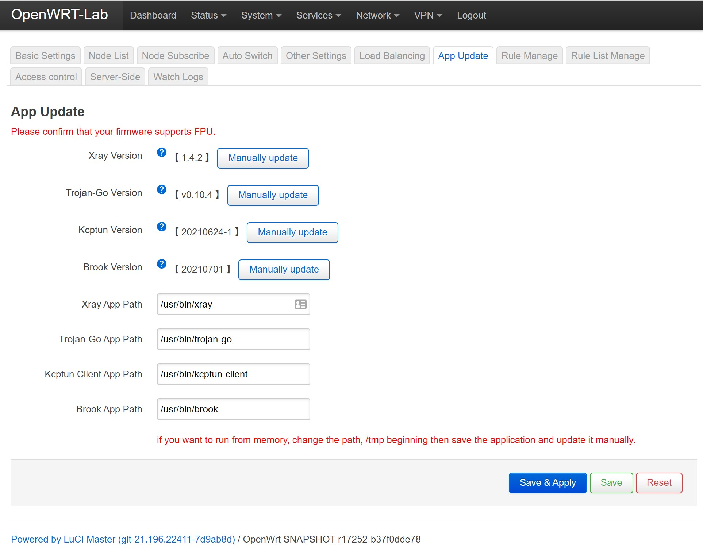

# **OpenWrt 21.02 x86** 固件 Release

## 1. 说明

依据官方 OpenWrt 21.02 代码库编译，添加了若干官方库不提供但经常需要用到的插件。

镜像的 Google Drive [下载地址](https://drive.google.com/drive/folders/1oNbIwviHju9gB-u7NLPs1-FcKSOJJzjE?usp=sharing)。

> **Google Drive 仓库提供 VMKD、VHDX 等虚拟机磁盘文件，适合使用 VMware vSphere 或 Hyper-V 的虚拟机用户。**

本库仅为提供二进制镜像，因此除介绍文件，不提供任何源代码。因为并没有对源代码进行任何修改。

版本更新信息，请使用 Git Diff 工具查看 build-info 文件夹中的文件更新历史。

## 2. 官方库中选中的插件、kmod

参见 `build-info` 文件夹。

- 支持 Mellanox 最新版网卡，`mellanox-core-4` 和 `mellanox-core-5` 驱动都已经集成。支持 HPE 544+FLR 等网卡
- MWAN3 (普通用户建议关闭，有可能与 OpenClash TUN 模式冲突)
- QoS
- TTYD Terminal 网页版终端
- netdata: 在浏览器地址栏输入 your-ip-addr:19999 可打开 netdata 实时监控的 web 界面

## 3. 官方之外的插件

### 3.1 Open Clash

``` txt
// OpenClash 官方 GitHub 仓库链接：

https://github.com/vernesong/OpenClash
```

OpenClash 是一个强大的运行于 OpenWrt 系统的流量代理工具，支持非常不错的分流功能。配置项比较于 Passwall 要更为复杂，但是功能更好，广受高级用户们的喜欢。

> **Note**: 本套编译发行的 OpenClash 经过严格的测试，保证可以与 OpenWrt 21.02 系统完美匹配。**注意，如果你有 IPv6 的需求，请务必在 OpenClash 的配置页面里打开 IPv6 DNS 解析功能。** 如下图所示。


### 3.2 Passwall

**这是一个代理、分流工具。**

``` txt
// passwall 官方 GitHub 仓库链接：

https://github.com/xiaorouji/openwrt-passwall

选中的功能：

CONFIG_PACKAGE_luci-app-passwall=y
CONFIG_PACKAGE_luci-app-passwall_INCLUDE_Brook=y
CONFIG_PACKAGE_luci-app-passwall_INCLUDE_ChinaDNS_NG=y
CONFIG_PACKAGE_luci-app-passwall_INCLUDE_Kcptun=y
CONFIG_PACKAGE_luci-app-passwall_INCLUDE_NaiveProxy=y
CONFIG_PACKAGE_luci-app-passwall_INCLUDE_ShadowsocksR_Libev_Server=y
CONFIG_PACKAGE_luci-app-passwall_INCLUDE_Shadowsocks_Rust_Client=y
CONFIG_PACKAGE_luci-i18n-passwall-zh-cn=y
```

> **Note**: 因为 Trojan-Go 的编译比较复杂，而且官方库的 Golang 版本和 Trojan-Go 的版本要求有点区别，因此并未集成 Trojan-Go，若实在有需要，**可点击手动更新按钮，Passwall 会自动下载最新版 Trojan-Go 并自动安装。** 如下图所示 Manually update.



### 3.3 尚未集成的第三方插件 TO-DO

- 阿里云 DDNS 脚本：目前官方的 DDNS 插件不支持阿里云 DDNS，因此需要修改官方 ddns 插件。

> Note: 但是支持 dnspod.cn 腾讯云的 DDNS，经过测试比较稳定。

## 4. 免责声明

与本库相关的所有代码均可在 GitHub 找到并自行编译，这里只是分享一个我个人比较喜欢的取舍结果。**请勿用与本库相关的任何东西从事违法活动。**

## Reference

OpenWrt 官方库链接：github.com/openwrt/openwrt
